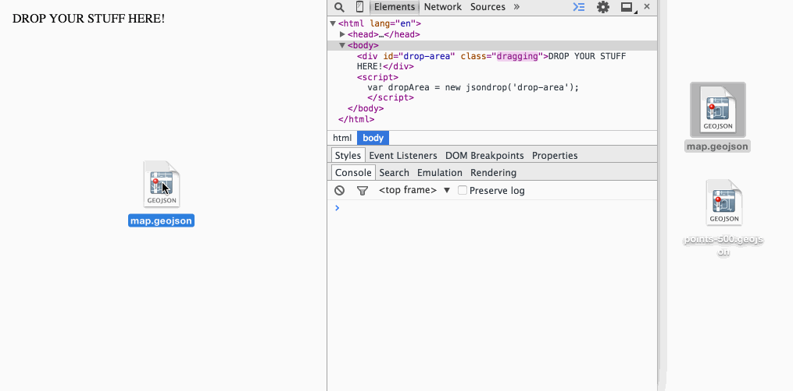

# jsondrop
> HTML5 drag &amp; drop JSON parser without the server.

`jsondrop` allows you to specify an element by it's `id` on the page to be turned into a "dropzone" for dragging and dropping JSON files. When a user drops a file into the element, the file is parsed and stored as JSON in your `jsondrop`-specified element. **This library is a work in progress!**

**This library doesn't do everything for you!** It's important to note `jsondrop` only does part of the work by taking the dropped files and converting them to a useable object in your javascript. See the section below to learn about [where your files are stored](https://github.com/svmatthews/jsondrop#where-are-my-files-stored)

## How to use it

**First** you should include the script in your `<head>`:

```html
<script src="path/to/jsondrop.js"></script>
```

**Second** create an element on your page that you want to be the drop area:

```html
<div id="drop-area"></div>
```

**Third** in your HTML you can instantiate a new `jsondrop` object by passing the ID of the element you'd like to turn into the dropzone:

```javascript
var dropArea = new jsondrop('drop-area');
```

## Where are my files stored?

In step three above, you can see that you have access to an entire `jsondrop` object in your own variable `dropArea`. To access the files that have been dropped in this specific element you'll have to navigate the object tree in `dropArea`. Below is a quick GIF of the process being inspected through a browser inspector.


